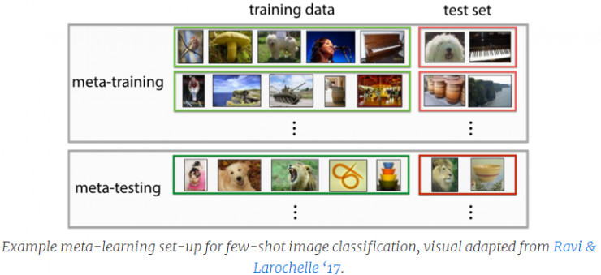
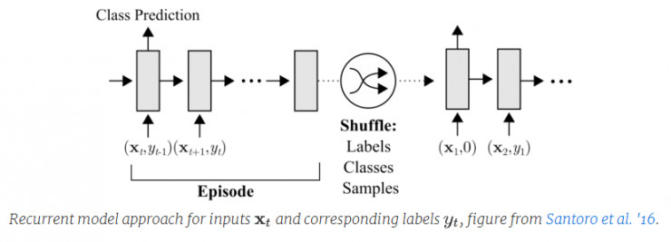
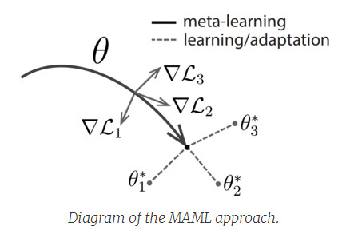
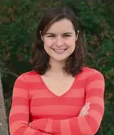

* content
{:toc}
meta-learning (元学习) 是

第一次听到这个描述，我极其兴奋，这也许是迈向强人工智能的第一步。我一直相信，按之前各种改网络结构的搞法是不可能搞出强人工智能的，因为只要看到一点，即在很多任务的学习上，算法需要花费比人类多得惊人的时间以及多得惊人的数据才能达到人类同样的水平。

最早的元学习方法可以追溯到上世纪 80 年代末和 90 年代初，Jürgen Schmidhuber 的论文、Yoshua 和 Samy Bengio 的工作中都有提到。近年来，元学习成为热门话题，关于它的论文席卷而来。它最常用在这些地方：**超参数和神经网络优化**，**发掘好的网络架构**，**小样本学习**和**快速强化学习**。

## 元学习方法的工作原理

先是让系统接触大量的任务进行训练，然后再测试这个系统学习新任务的能力。比如会有这样的任务：要识别一张新图像是五个分类中的哪一个，每个分类只有一张示例图像；或学会在一次遍历之后高效的走出迷宫。这与许多标准的机器学习技术不同，它们的方法是在单个任务上进行训练，在任务中单独留出的样例中进行测试。

元学习过程中，在元训练集中训练模型学习任务。有两种优化在起作用：一种是学习器，它负责学习新任务；另一种是元学习器，它负责训练学习器。元学习的方法通常分为三类：循环模型、度量学习和学习优化器法。

### 循环模型

有一些做法可以训练出一个循环模型，例如LSTM网络，先是连续地接收数据集，然后处理来自目标任务的输入。对于图像识别来说，可能需要持续把数据集中成对的图像—标签对传递给网络，然后再传递要识别的新样例。

元学习器使用梯度下降法，而学习器只是简单地在循环网络中执行。这是最常见的方法之一，已经被用于小样本识别和回归、元强化学习。**由于其灵活性，这种方法比其他方法(从元的角度) 更低效，因为学习器网络需要从零开始找到学习策略。**

### 度量学习

这种方法需要学习一个度量空间，在这个空间里学习特别高效。该方法主要用于小样本识别。直观地说，如果目标是从少量的样本图像中学习，那么有一种简单的方法是用已有的样本图像与试图识别的图像作比较。

但是，正如你可能想象的那样，在像素空间中比较图像不会起到很好的效果。你可以在一个训练好的度量空间里训练孪生网络或执行比较。与以前的方法一样，元学习使用梯度下降法（或你偏好的神经网络优化器），鉴于学习器扮演的角色是元训练度量空间中的对比体系，例如近邻算法。这些方法可以很好地用于小样本识别，即使在回归或强化学习等其他元学习领域尚未证实有同样的效果。

### 学习优化器法

最后一个方法是学习优化器法。在这种方法中，一个网络（元学习器）学习更新另一个网络（学习器），以便学习器高效地学习任务。为了更好地优化神经网络，人们对这种方法进行了广泛的研究。元学习器通常是循环网络，以便记住之前是如何校正学习器模型的。元学习器可以用强化学习或监督学习的方式来训练。Ravi 和 Larochelle 最近演示了这种方法用于小样本图像识别的优点，提出了这样的观点：学习器模型也是一种需要学习的优化过程。

## 未知模型元学习法（Model-Agnostic Meta-Learning ，MAML）

可以证明，目前为止，迁移学习最大的成果是用ImageNet预训练来初始化视觉网络权重。特别是，当处理新的视觉任务时，众所周知的范式是首先为任务收集带标签的数据集，得到预训练过的ImageNet分类器，然后利用梯度下降法，基于采集到的数据来微调网络。使用这种方法，神经网络可以更有效地从更少的数据集中学习新的基于图像的任务。

然而，预训练的效果也就这样。因为网络的最底层仍然需要高度适应新的任务，像小样本学习那样太小的数据集仍会造成严重的过拟合。此外，遗憾的是现在在语音、语言和控制等非视觉领域没有类似的预训练体系。从微调的方法既然取得了这么好得效果，有什么可以借鉴的吗?

需要找到能够根据少量样本高效地进行微调的表征，那么有没有可能直接对初始表征做优化呢？这是伯克利AI研究所最近提出的未知模型元学习法 (MAML) 背后的想法 [(论文)](https://arxiv.org/pdf/1703.03400.pdf) [(代码)](https://github.com/cbfinn/maml)。和其他元学习法一样，MAML能在大量不同的任务上训练，通过少量的梯度步骤，能快速得到适应新任务的表征。

元学习器试图找到一个初始值，不仅可以适应各种问题，而且可以快速（只需少量步骤）高效（只使用几个例子）地适应。下面是一个可视化图–假设我们正试图寻找一组具有高度适应性的参数θ，在元学习过程中（粗线），MAML优化一组参数，以便当执行关于某个任务i（灰线）的梯度步骤时，参数接近i任务的最优参数θi*。

这种方法非常简单，并且有许多优点：第一，它不会对模型的形式做任何假设；第二，它相当有效，没有为元学习引入额外的参数，并且使用已知的优化过程 (梯度下降法)，而不是必须从零开始想出策略；最后，它极易应用于许多领域，包括分类、回归和强化学习。

尽管这种方法很简单，令人惊讶的是，它在流行的小样本图像识别基准、Omniglot和MiniImageNet2上优于现在的许多方法，包括更复杂的或适用于特定领域的方法。

虽然这一实现方法非常的简单，但是我们发现它在标准训练集上的效果甚至超过了已有的复杂方法。除去了分类任务外，我们还尝试着模拟机器人的动作实现不同的目标，也成功的实现了本文开始提到的多样性与适应性！我们将MAML和策略梯度结合起来进行强化学习，我们发现MAML仅仅在一个梯度的更新后就发现了一个可以模拟机器人适应运动方向和速度的策略。

除了识别之外，他们还试图学习如何让模拟机器人的行为适应不同的目标，这类似于文章最开始提到多才多艺性。为此，他们将MAML与强化学习中的策略梯度方法结合。通过MAML可以学到一种策略，它可以让模拟机器人在单一的梯度更新中适应移动方向和速度。

该方法的泛化性——它可以与任何足够平滑的模型结合，这样就可以用基于梯度的方法进行优化了——这使得MAML不只适用于本文中探讨的案例，还适用于广泛的领域和学习目标。

MAML方法能够有效教会系统适应不同场景，他们也希望这能有助于更快地开发出能够在现实世界中学到多种技能的多功能人工智能。

## 1. 为什么有用

针对人类学习与机器学习在时间和数据量需求上的这种巨大差异，让我们思考人类大脑中针对某项学习任务是怎么快速学习的，元学习研究人员提出了两种主要理论：

- 学习的先验：人类可以很快地学会新任务是因为我们可以利用在过去的任务中学到的信息，比如物体在空间里移动的直观的物理知识，或者是在游戏中掉血得到的奖励会比较低这样的元知识。
- 学习的策略：在我们的生活中（也许是从进化时间上讲的），我们收集的不仅是关于这个世界对象级的信息，还生成了一种神经结构，这种神经结构在将输入转化为输出或策略的问题上的效率更高，即使是在新环境中也不例外。

显然，这两个想法并非互相排斥，在这两个想法间也没有严格的界限：一些与现在的世界交互的硬编码策略可能是基于这个世界的深度先验的，例如（至少就本文而言）这个世界是有因果结构的。也就是说，我认为这个世界上的事情都可以用这两个标签分开，而且可以将这两个标签看作相关轴的极点。

## 2. 八卦

Sergey Levine 是 UC Berkeley 电气工程和计算机科学系的助理教授。目前他主要在两大研究中心活动：伯克利 AI 实验室（简称 BAIR）和加州大学社会利益信息技术研究中心人与机器人部门（简称 CPAR）。2009 年 Sergey Levine 同时获得斯坦福大学计算机科学学士和硕士学位，并于 2014 年获得斯坦福大学计算机科学博士学位。2016 年秋季他加入UC Berkeley 电气工程与计算机科学系，主要研究用于决策和控制的机器学习技术，重点研究深入学习和强化学习算法。工作的应用包括自动机器人和车辆，以及计算机视觉和图形。

Chelsea Finn 是 Levine 实验室的一名博士研究生。2014 年 Chelsea Finn 毕业于麻省理工大学电气工程与计算机科学学院，2014 年进入 UC Berkeley 攻读 PHD（学术研究型博士），主要研究机器人感知与控制。在进入 BAIR 之前，Chelsea Finn 还曾在 Consyl、Google 和 Sandia 国家实验室工作过。

他们于 2017 年年底推出了一款名叫 Vestri 的机器人，区别于以往机器人，Vestri 具有完全自学执行任务和可预测行动结果两大特点。

（1）完全自学执行任务

许多常见的机器人只会按照给定的程序处理物体，没有“自己的想法”，和机器无异。但Vestri看到眼前的物体后，会生成自己的判断和想法，并据此不断探索如何去“把玩”，整个过程完全不需要人类的监督，可以说是“自学成才”了。

Vestri 的研发者之一，加州伯克利大学分校的助理教授 Sergey Levine 说 “虽然这种机器人的能力还很有限，但它完全是自动学习技能的，Vestri 根据已记录的交互模式（这些交互模式来自它之前自主学习的过程）来预测与未见过的新物体进行复杂物理交互时，选择不同的方式分别会产生哪种结果。”

（2）可预测行动结果

常见的机器人都是按照事先预设好的指令代码进行执行，它们只理会 “做” 或者 “不做” 动作，并不会考虑这些动作是否会带来不好的结果。

Vestri 可以在执行特定动作之前，就预测到这种动作将会产生怎样的结果。当然它能实现这种 “特异功能”，得益于它在之前 “摆弄” 物体时，通过自带摄像头收集到了大量的数据。这些图像数据信息就存储在 Vestri 的系统内，预测图像的像素将如何从一帧移动到下一帧。

Vestri 机器人本身并无特别之处，而它两大特点，其实都基于一项最新的技术：“视觉预见”（visual foresight）。该项技术由伯克利AI实验室研发，其技术核心是基于卷积循环视频预测（convolutional recurrent video prediction）或动态神经平流（简称DNA）（dynamic neural advection）的深度学习技术。

## Reference

1 [互联网广告综述之点击率特征工程](https://blog.csdn.net/mytestmy/article/details/19088827)

2 [广告点击率的贝叶斯平滑](https://blog.csdn.net/mytestmy/article/details/19088519)

3 Wang, Xuerui, et al. "Click-through rate estimation for rare events in online advertising." *Online Multimedia Advertising: Techniques and Technologies*. IGI Global, 2011. 1-12.