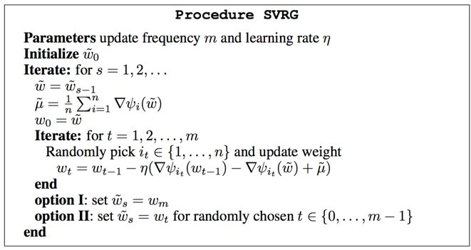

最佳拜读了下大名鼎鼎的 SVRG 算法 [[5]](#Reference)，本文做个简单的阅读理解，并描述了如何将 SVRG 算法改造成一种在线算法，当然我这里不保证改造后算法的各种理论性质。

* content
{:toc}

## 1. 背景介绍

考虑优化问题：

$$
min \, F(w)=\frac{1}{n}\sum_{i=1}^{n}f_i(w)
$$

当我们采用 Gradient Descent (GD) 方法时，$$w$$ 的更新公式是：

$$
w^{(t)}=w^{(t-1)}-\eta_t\nabla F(w^{(t-1)})=w^{(t-1)}-\frac{\eta_t}{n}\sum_{i=1}^{n}\nabla f_{i}(w^{(t-1)})
$$

梯度下降方法可以追溯到 Cauchy 1847 年的论文 [[1]](#Reference)。梯度下降对于样本数目比较多的时候有一个很大的劣势，那就是每次需要求解所有样本的梯度，导致计算量大增，所以实际生产环境中，往往采用随机梯度下降算法（Stochastic Gradient Descent），一般简写做 SGD，它于 1951 和 1952 年在文献 [[2,3]](#Reference) 中被提出。SGD 每次迭代的时候均匀随机得选择一个样本或者 mini-batch 做更新。当我们采用 SGD 方法来进行计算的时候，$$w$$ 的更新公式是

$$
w^{(t)}=w^{(t-1)}-\eta_t\nabla f_{i_t}(w^{(t-1)})
$$

相对于梯度下降，SGD 的好处非常明显，就是可以减少每次更新的计算代价，不过也正是因为每次都是随机的使用一个样本或一个 mini batch 来估计梯度，因此**对梯度估计的方差就大了**。这给 SGD 带来的问题是收敛速度不如梯度下降，也就是说为了达到同样的精度，SGD 需要的总迭代次数要大于梯度下降。从收敛速度分析上看，梯度下降则可以在目标函数强凸的情况下做到 $$O(\rho^T) (\rho<1)$$ 的线性收敛（linear convergence），在目标函数为凸函数的情况下可以做到次线性收敛 $$O(1/T)$$（收敛速度是衡量优化算法计算复杂度的基本工具，可以参考 [wiki](https://en.wikipedia.org/wiki/Rate_of_convergence "Rate_of_convergence") 或者 [这里](https://zhuanlan.zhihu.com/p/27644403)）。而 SGD 能够在目标函数强凸并且递减步长的情况下只做到 $$O(1/T)$$ 的次线性收敛（sublinear convergence）。至于为什么对梯度估计的方差过大会降低收敛速度，以及 SGD 为什么一定要步长递减，具体原因可参考文章 [[4]](#Reference) 的 Theorem 4.6 和 Theorem 4.7 以及 Theorem 4.8，Theorem 4.9 和 Theorem 4.10，简单来说就是如果步长不是递减的，SGD 会收敛到最优解的一个领域中，对梯度估计的噪声让它最终无法进一步收敛。

总结起来就是，如果想快速得到一个可以勉强接受的解，SGD 比梯度下降更加合适，但是如果想得到一个精确度高的解，应当选择梯度下降。SGD 后来衍生出了非常多的变种，尤其是一类分析 regret 的 online 算法，包括 Adagrad、Dual Averaging、FTRL 等。但是是否可以把 SGD 做到和梯度下降一样的线性收敛呢？直到 2012 和 2013 年，SAG 与 SVRG 算法发表在 NIPS 上回答了这个问题，**成为近几年 SGD 类算法的最大突破**。

## 2. 方差缩减方法 Noise Reduction Methods

既然影响 SGD 收敛速度的主要原因之一是在所计算的梯度的方差，那就想办法降低这个方差，这一类方法就被称为方差缩减方法（Noise Reduction Methods）。在所谓的方差缩减方法中，又可以分为 3 小类，第一类动态采样方法（dynamic sampling methods）是通过在计算梯度时逐步增加样本量来减少梯度估计的方差；第二类迭代平均方法（iterate averaging methods）则是通过对得到的 $$w$$ 进行历史平均来减少其方差；第三类梯度聚合方法（gradient aggregation methods）则是通过存储历史梯度，在每次估计梯度时用历史梯度来做修正，我们主要要谈的 SVRG 算法就属于这一类。

## 3. SVRG 算法

在 SVRG 算法之前，有两个第三类的方差缩减方法分别称为 SAG 和 SDCA [[7]](#Reference) ，但是这两种方法都要求存储所有的梯度，在实际的大规模工业应用中并不实用。SVRG 算法则不用存储所有的梯度，并且在目标函数光滑和强凸的情况下做到线性收敛速度。

**SVRG 算法**（这里的 $$\psi$$ 就是上文中的 $$f$$）

SVRG 算法在每一轮迭代的内部有一个内部的迭代，在进行内部迭代前用当前的 $$\tilde w$$ 值计算一次所有样本的平均梯度 $$\tilde\mu$$，内部迭代的初始值被赋予为当前的 $$\tilde w$$，内部迭代中每次的梯度采用如下方式计算：

$$
g \, \leftarrow \, \nabla \psi_{i_t}(w_{t-1})-\nabla\psi_{i_t}(\tilde w)+\tilde \mu
$$

对此公式为什么能降低梯度估计的方差有个直观的解释，因为 $$\nabla\psi_{i_t}(\tilde w)$$ 的期望就是 $$\tilde\mu$$，因此可以将 $$-\nabla\psi_{i_t}(\tilde w)+\tilde \mu$$ 视为梯度估计 $$\nabla\psi_{i_t}(\tilde w)$$ 的 bias，那么在每一次的迭代中，算法都对基于当前参数 $$w_{t-1}$$ 做的梯度估计 $$\nabla \psi_{i_t}(w_{t-1})$$ 进行了一次修正。在 SGD 的收敛性分析中，假定了样本梯度的方差是有个常数上界的 (见文章 [[4]](#Reference) 的 Assumption 4.3(c))，正是这个常数上界的存在导致 SGD 算法无法线性收敛，SVRG 利用它新的更新方式可以让估计的梯度方差有个不断减小的上界 (见文章 [[4]](#Reference) 的 Theorem 5.1)，这就是 SVRG 算法的核心思想，这也是为什么这个算法被称为 SVRG（stochastic variance reduced gradient）的原因，更多更为正式更为数学的分析可参考 bottou 大神写的综述文章 [[4]](#Reference)。

## 4. SVRG 算法的进化

**mini-batch SVRG 算法** [[9]](#Reference)

看作者名字就知道这是一位日本同学的文章，是 mini-batch 版本的 SVRG，并同时采用 Nesterov 加速。

**SAGA算法** [[6]](#Reference)

**SCSG 算法** [[8]](#Reference)。

## 5. SVRG for online learning

## Reference

[1] Cauchy, Augustin. “Méthode générale pour la résolution des systemes d’équations simultanées.” Comp. Rend. Sci. Paris 25.1847 (1847): 536-538.

[2] Robbins, Herbert, and Sutton Monro. “A stochastic approximation method.” The annals of mathematical statistics (1951): 400-407.

[3] Kiefer, Jack, and Jacob Wolfowitz. “Stochastic estimation of the maximum of a regression function.” The Annals of Mathematical Statistics 23.3 (1952): 462-466.

[4] Bottou, Léon, Frank E. Curtis, and Jorge Nocedal. "Optimization methods for large-scale machine learning." *SIAM Review* 60.2 (2018): 223-311.

[5] Johnson, Rie, and Tong Zhang. "Accelerating stochastic gradient descent using predictive variance reduction." *Advances in Neural Information Processing Systems*. 2013.

[6] Defazio, Aaron, Francis Bach, and Simon Lacoste-Julien. "Saga: A fast incremental gradient method with support for non-strongly convex composite objectives." *Advances in Neural Information Processing Systems*. 2014.

[7] Shalev-Shwartz, Shai, and Tong Zhang. "Accelerated mini-batch stochastic dual coordinate ascent." *Advances in Neural Information Processing Systems*. 2013.

[8] Lei, Lihua, and Michael Jordan. "Less than a Single Pass: Stochastically Controlled Stochastic Gradient." *Artificial Intelligence and Statistics*. 2017.

[9] Nitanda, Atsushi. “Stochastic proximal gradient descent with acceleration techniques.” Advances in Neural Information Processing Systems. 2014.